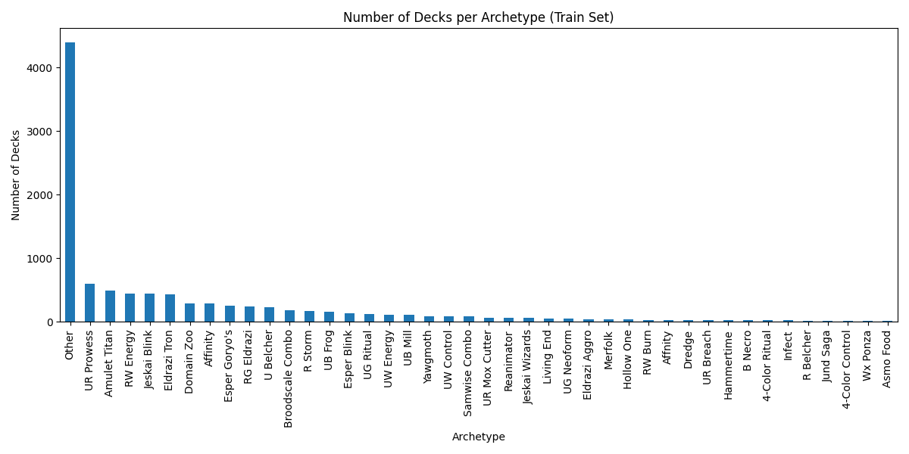
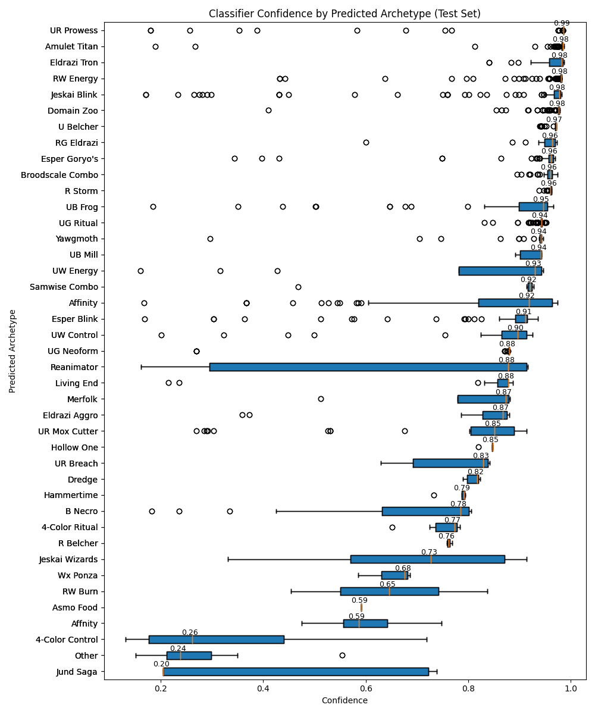

# Discovering Deck Archetypes in Magic: The Gathering 

### Data Preprocessing 

For this project, I collected a set of Magic: The Gathering decklists from public sources. This data was collected utilizing a web scraper that gathered competitive decklists from recent tournaments. Each decklist includes the date, format, and the full set of cards in the deck.

Before analysis, each deck was converted into a list of individual cards, treating multi-word card names as a single item. Cards with multiple forms (such as split or modal cards) were simplified to only consider the main form, which primarily defines a deck’s strategy. This processing ensured that decks could be compared fairly, emphasizing the cards most important for defining deck style.

### Selection, Training, and Use of a Machine Learning Model 

To automatically identify groups of similar decks, I used a technique called clustering. Clustering finds groups of items that are similar to each other without pre-existing labels. In this project, decks that shared many of the same key cards were grouped together.

Each deck was converted into a vector using TF-IDF, which gives more weight to cards that are frequent within a group but rare across all decks. I reduced the number of dimensions using SVD to make clustering more efficient and effective. After clusters were identified, each group was reviewed, and a descriptive name was assigned based on the main cards. Finally, a logistic regression classifier was trained to assign new decks to these discovered archetypes.

### Interpretation of Results 

The classifier was trained on decks labeled with 42 archetypes. The mean classifier confidence when assigning archetypes to test decks was 91.2%. The confidence varies by archetype, reflecting how certain the model is for different deck types.

Below are some charts showing the distribution of archetypes and their prediction confidence levels:

### Ethical Implications 

The dataset used in this project was collected through automated web scraping of publicly available decklists from competitive Magic: The Gathering websites. While the data was accessible without authentication and intended for public viewing, scraping raises ethical considerations related to consent, data ownership, and server load.

Care was taken to scrape data at a reasonable rate and only collect information relevant to the analysis, avoiding any personally identifiable information. Additionally, the dataset reflects competitive environments, which introduces bias toward popular or successful strategies and may underrepresent casual or experimental playstyles. As a result, conclusions drawn from this system should be understood as describing trends in competitive play rather than the full range of player behavior.

### Additional Information 

[Scraper Code](https://github.com/drewjhowells/DeckIQ-Service.git) 